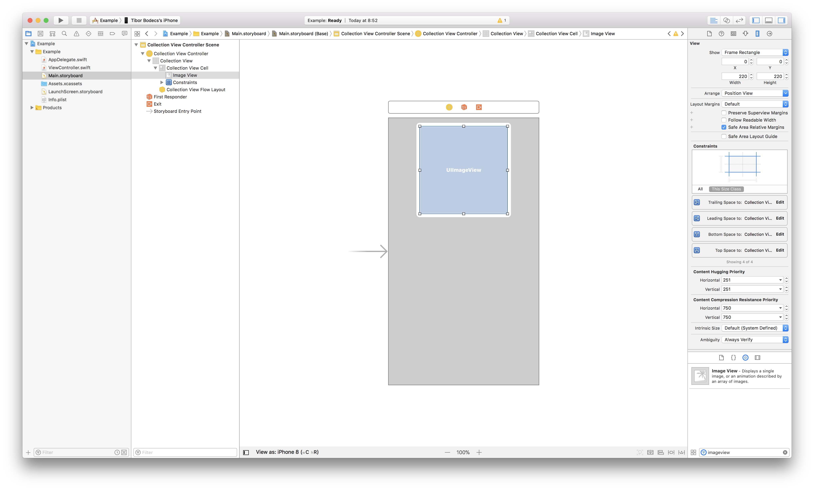

## Circular cells inside a collection view

Achieving the goal is relatively easy, but if you don't know what's going on in the background it's going to be harder than you would think first. So let's create a new project add a storyboard with a `UICollectionViewController`, drag a `UIImageView` inside the cell, resize it, add some constraints, set the cell identifier.



It should look something like the image above. Nothing special just a simple UI for our example application. Now search for some random image, add it to the project and let's do some real coding. First I'll show you the little trick inside of the cell subclass.

```swift
class Cell: UICollectionViewCell {

    @IBOutlet weak var imageView: UIImageView!

    override var bounds: CGRect {
        didSet {
            layoutIfNeeded()
        }
    }

    override func awakeFromNib() {
        super.awakeFromNib()

        imageView.layer.masksToBounds = true
    }

    override func layoutSubviews() {
        super.layoutSubviews()

        setCircularImageView()
    }

    func setCircularImageView() {
        imageView.layer.cornerRadius = CGFloat(
            roundf(Float(imageView.frame.size.width / 2.0))
        )
    }
}
```

Can you see it? Yes, you should override the bounds property. As the next step we have to write the controller class with some basic data source for the collection view and with the proper support for the rotation methods. 🤓

```swift
class ViewController: UICollectionViewController {

    override func collectionView(
        _ collectionView: UICollectionView,
        numberOfItemsInSection section: Int
    ) -> Int {
        30
    }

    override func collectionView(
        _ collectionView: UICollectionView,
        cellForItemAt indexPath: IndexPath
    ) -> UICollectionViewCell {

        let cell = collectionView.dequeueReusableCell(
            withReuseIdentifier: "Cell", 
            for: indexPath
        ) as! Cell

        cell.imageView.image = UIImage(named: "Example.jpg")
        cell.imageView.backgroundColor = .lightGray

        return cell
    }

    override func traitCollectionDidChange(
        _ previousTraitCollection: UITraitCollection?
    ) {
        super.traitCollectionDidChange(previousTraitCollection)

        guard
            let previousTraitCollection = previousTraitCollection,
            traitCollection.verticalSizeClass != previousTraitCollection.verticalSizeClass ||
            traitCollection.horizontalSizeClass != previousTraitCollection.horizontalSizeClass
        else {
            return
        }

        collectionView?.collectionViewLayout.invalidateLayout()
        collectionView?.reloadData()
    }

    override func viewWillTransition(
        to size: CGSize, 
        with coordinator: UIViewControllerTransitionCoordinator
    ) {
        super.viewWillTransition(to: size, with: coordinator)

        collectionView?.collectionViewLayout.invalidateLayout()

        coordinator.animate(alongsideTransition: { context in

        }, completion: { context in
            collectionView?.collectionViewLayout.invalidateLayout()

            collectionView?.visibleCells.forEach { cell in
                guard let cell = cell as? Cell else {
                    return
                }
                cell.setCircularImageView()
            }
        })
    }
}

extension ViewController: UICollectionViewDelegateFlowLayout {

    func collectionView(
        _ collectionView: UICollectionView,
        layout collectionViewLayout: UICollectionViewLayout,
        sizeForItemAt indexPath: IndexPath
    ) -> CGSize {
        .init(
            width: collectionView.frame.size.width/3.0 - 8,
            height: collectionView.frame.size.width/3.0 - 8
        )
    }
}
```

If you are familiar with collection views, you might ask why am I doing this tutorial? It's so simple. It just works, right? No, actually without the overridden bounds property the example would look something like this on the left side. 😢


Funny, huh? The image on the right side is the actual result with the overridden bounds, that's the expected behavior. Scrolling and rotation is going to be really strange if you don't override bounds and you don't reset the cornerRadius property for the visible views. You might ask: but why? 🤔

## Layers, springs & struts and some explanation

Apple still has "Springs & Struts" based code inside of UIKit. This means that frame and bound calculations are happening in the underlying system and the constraint system is trying to work hard as well to figure out the proper measures.

> "Springs & Struts" needs to die!

While there is an `init(frame:)` method, or a `required init(coder:)` these layout things will suck as hell. I really like Interface Builder, but until we can not get a fine tool to create great user interfaces IB is going to be just another layer of possible bugs.

This issue won't even be there if you create the cell from code only using auto layout constraints or layout anchors! It's because IB creates the cell based on the frame you gave in while you designed your prototype. But if you forget `init(frame:)` and you just create a new `UIImageView` instance and let auto layout do the hard work, the layout system will solve everything else. Check this.

```swift
class Cell: UICollectionViewCell {

    weak var imageView: UIImageView!

    required init?(coder aDecoder: NSCoder) {
        fatalError("init(coder:) has not been implemented")
    }

    override init(frame: CGRect) {
        super.init(frame: frame)

        translatesAutoresizingMaskIntoConstraints = false

        let imageView = UIImageView()
        imageView.translatesAutoresizingMaskIntoConstraints = false
        addSubview(imageView)
        imageView = imageView

        imageView.topAnchor.constraint(equalTo: topAnchor)
        imageView.bottomAnchor.constraint(equalTo: bottomAnchor)
        imageView.leadingAnchor.constraint(equalTo: leadingAnchor)
        imageView.trailingAnchor.constraint(equalTo: trailingAnchor)
    }

    override func layoutSubviews() {
        super.layoutSubviews()

        imageView.layer.masksToBounds = true
        imageView.layer.cornerRadius = CGFloat(
            roundf(Float(imageView.frame.size.width/2.0))
        )
    }
}
```

Obviously you have to write more code, register your cell class manually inside the controller class and you also have to override the layoutSubviews method inside the cell, but it'll work as it is expected. 🙄

```swift
collectionView?.register(Cell.self, forCellWithReuseIdentifier: "Cell")
```

Anyway, after you register the programmatically created cell you'll have a nice way of displaying circular images. Using this technique is quite tricky, but it definitely works in every case. You can download the example from The.Swift.Dev. tutorials on [GitHub](https://github.com/theswiftdev/tutorials).
